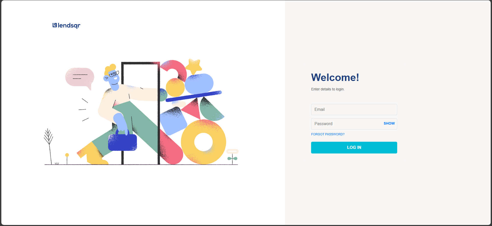
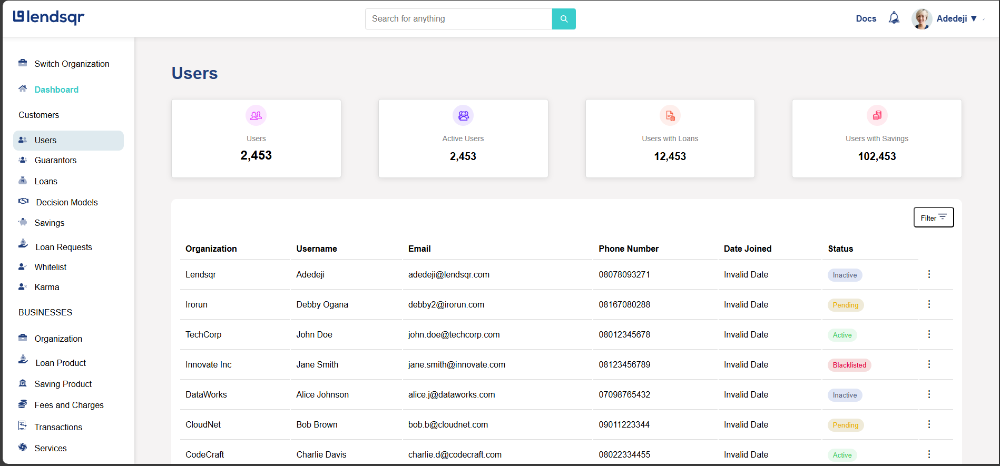
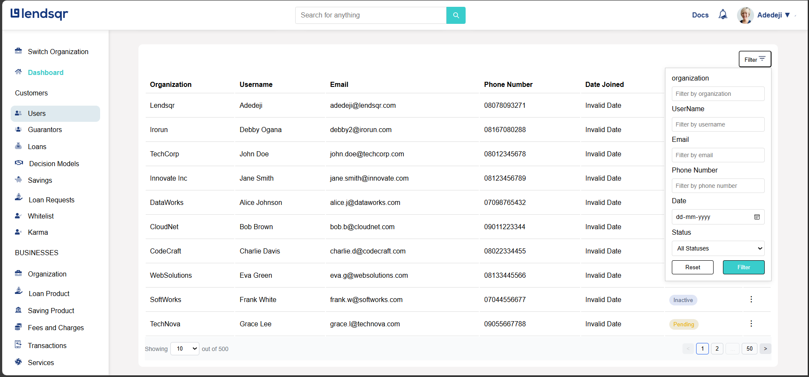
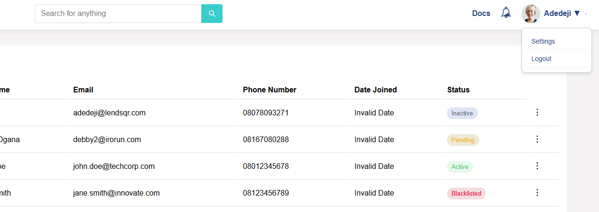
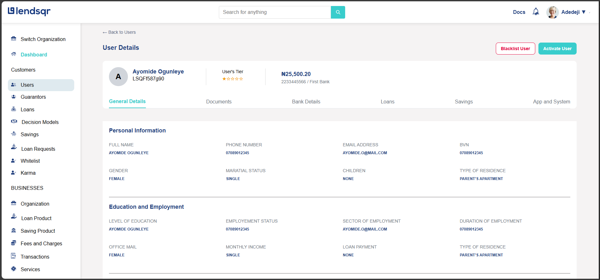

# Getting Started with Create React App

This project was bootstrapped with [Create React App](https://github.com/facebook/create-react-app).

## Available Scripts

In the project directory, you can run:

### `npm start`

Runs the app in the development mode.\
Open [http://localhost:3000](http://localhost:3000) to view it in the browser.

The page will reload if you make edits.\
You will also see any lint errors in the console.

### `npm test`

Launches the test runner in the interactive watch mode.\
See the section about [running tests](https://facebook.github.io/create-react-app/docs/running-tests) for more information.

### `npm run build`

Builds the app for production to the `build` folder.\
It correctly bundles React in production mode and optimizes the build for the best performance.

The build is minified and the filenames include the hashes.\
Your app is ready to be deployed!

See the section about [deployment](https://facebook.github.io/create-react-app/docs/deployment) for more information.

### `npm run eject`

**Note: this is a one-way operation. Once you `eject`, you can’t go back!**

If you aren’t satisfied with the build tool and configuration choices, you can `eject` at any time. This command will remove the single build dependency from your project.

Instead, it will copy all the configuration files and the transitive dependencies (webpack, Babel, ESLint, etc) right into your project so you have full control over them. All of the commands except `eject` will still work, but they will point to the copied scripts so you can tweak them. At this point you’re on your own.

You don’t have to ever use `eject`. The curated feature set is suitable for small and middle deployments, and you shouldn’t feel obligated to use this feature. However we understand that this tool wouldn’t be useful if you couldn’t customize it when you are ready for it.

## Learn More

You can learn more in the [Create React App documentation](https://facebook.github.io/create-react-app/docs/getting-started).

To learn React, check out the [React documentation](https://reactjs.org/).

nstallation
First the project should be installed before running the development server

npm install
npm start

OR

yarn install
yarn start

Technologies used : 
React
Scss
Typescript
API from mocky.io

Starting of the Project:

Login Page
Users can log in with valid credentials:

Email: admin@lendsqr.com, Password: password123
Email: user@lendsqr.com, Password: userpass
Login data is stored using localStorage.
 here i use localstorage for the login page.

 

Dashboard
Contains a Navbar, Sidebar, User Stats, and User Table.
Universal Filter: Filters all columns.
Pagination & Row Selection: Controls at the bottom of the table.

In this image as you can see the filter option there top right of the table i make it one universal so you can filter all the column data from here.
also added pagination at the right bottom of the table and option to see how many rows you want to see at the single page which is bottom left of the table

In this imae you can see if we click on the user icon it will popout two options in that if you click on the loge out button you will log out.

here if you click on that tree dot so you will go to the userdetail page.

this is the user detail page.

Displays detailed user information.

This front-end task was completed as per the requirements. ✅
let me know it anything change needed.. :)
